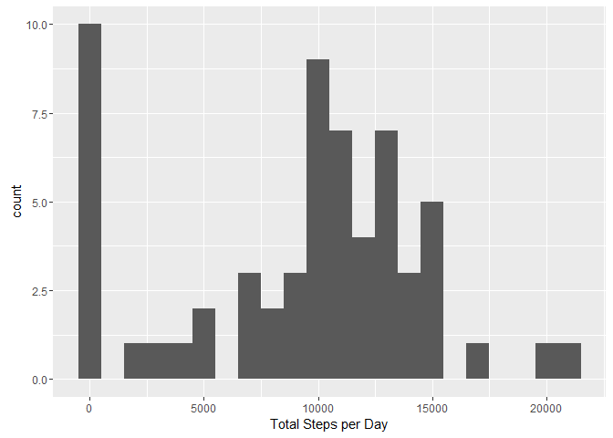
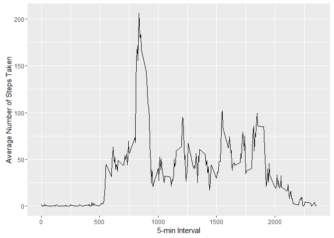
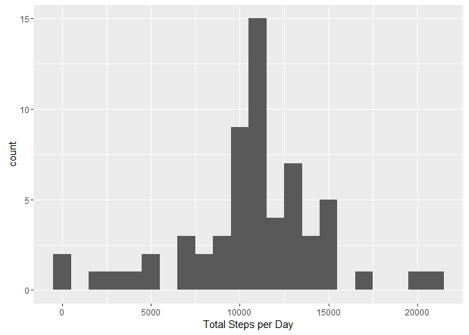
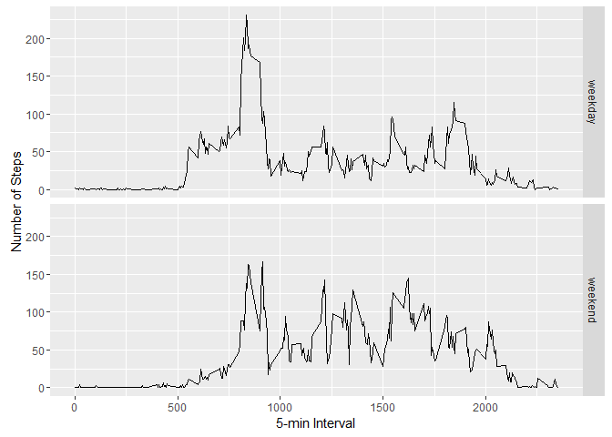

# Reproducible Research: Peer Assessment 1
Lesky Anatias  


## Loading and preprocessing the data

Since the GitHub repository also contains the activity dataset, we need to first unzip the file before start working on the data.   

```r
unzip(zipfile="activity.zip")
data <- read.csv("activity.csv", sep = ",")
```

In order to verify whether the data is suitable for analysis, we perform several functions below: 

```r
names(data)
```

```
## [1] "steps"    "date"     "interval"
```

```r
str(data)
```

```
## 'data.frame':	17568 obs. of  3 variables:
##  $ steps   : int  NA NA NA NA NA NA NA NA NA NA ...
##  $ date    : Factor w/ 61 levels "2012-10-01","2012-10-02",..: 1 1 1 1 1 1 1 1 1 1 ...
##  $ interval: int  0 5 10 15 20 25 30 35 40 45 ...
```

```r
head(data[which(!is.na(data$steps)), ]) # dataset with NAs removed
```

```
##     steps       date interval
## 289     0 2012-10-02        0
## 290     0 2012-10-02        5
## 291     0 2012-10-02       10
## 292     0 2012-10-02       15
## 293     0 2012-10-02       20
## 294     0 2012-10-02       25
```
The format of the file is ready for analysis. No further processing is required. 


## What is mean total number of steps taken per day?

```r
library(ggplot2)
```

```
## Warning: package 'ggplot2' was built under R version 3.2.5
```

```r
total.steps <- tapply(data$steps, data$date, FUN=sum, na.rm=TRUE)
head(total.steps)
```

```
## 2012-10-01 2012-10-02 2012-10-03 2012-10-04 2012-10-05 2012-10-06 
##          0        126      11352      12116      13294      15420
```

```r
qplot(total.steps, binwidth=1000, xlab="Total Steps per Day")
```

<!-- -->

Then we can find the mean and median with summary function below:

```r
summary(total.steps)
```

```
##    Min. 1st Qu.  Median    Mean 3rd Qu.    Max. 
##       0    6778   10400    9354   12810   21190
```

Or using the following functions:

```r
mean(total.steps, na.rm=TRUE)
```

```
## [1] 9354.23
```

```r
median(total.steps, na.rm=TRUE)
```

```
## [1] 10395
```


## What is the average daily activity pattern?
The following depicts a time series plot (i.e. type = "l") of the 5-minute interval (x-axis) and the average number of steps taken averaged across all days.

```r
library(ggplot2)
averages <- aggregate(x=list(steps=data$steps), by=list(interval=data$interval),
                      FUN=mean, na.rm=TRUE)
ggplot(data=averages, aes(x=interval, y=steps)) +
    geom_line() +
    xlab("5-min Interval") +
    ylab("Average Number of Steps Taken")
```

<!-- -->

On average across all the days in the dataset, the 5-minute interval below contains the maximum number of steps:

```r
averages$interval[which.max(averages$steps)]
```

```
## [1] 835
```


## Imputing missing values
As mentioned in the assignment, the missing values are coded with `NA` and will introduce bias into our calculations.

The following function report the number of missing values in the dataset.

```r
missing <- is.na(data$steps)
sum(missing)
```

```
## [1] 2304
```

To avoid the bias, all of the missing values can be replaced with mean value of its 5-minute interval.

```r
mean.value <- function(steps, interval) {
    missing_data <- NA
    if (!is.na(steps))
        missing_data <- c(steps)
    else
        missing_data <- (averages[averages$interval==interval, "steps"])
    return(missing_data)
}
missing_data.data <- data
missing_data.data$steps <- mapply(mean.value, missing_data.data$steps, missing_data.data$interval)
```

Using the new dataset, we can now create a histogram of the total number of steps taken each day.

```r
total.steps <- tapply(missing_data.data$steps, missing_data.data$date, FUN=sum)
qplot(total.steps, binwidth=1000, xlab="Total Steps per Day")
```

<!-- -->

Then we can find the mean and median with summary function below:

```r
summary(total.steps)
```

```
##    Min. 1st Qu.  Median    Mean 3rd Qu.    Max. 
##      41    9819   10770   10770   12810   21190
```

Or using the following functions:

```r
mean(total.steps, na.rm=TRUE)
```

```
## [1] 10766.19
```

```r
median(total.steps, na.rm=TRUE)
```

```
## [1] 10766.19
```

Mean and median values seems to be higher than the original dataset after imputing missing data. The reason is
that after replacing the missing `steps` values with the mean `steps` of associated `interval` value, the `NA` values that were previously being ignored or are removed from the histogram of original dataset are now included in the calculation.


## Are there differences in activity patterns between weekdays and weekends?

First, replace the day information with it's associate `weekend` or `weekday` values.

```r
is_weekday_or_weekend <- function(date) {
    day <- weekdays(date)
    if (day %in% c("Monday", "Tuesday", "Wednesday", "Thursday", "Friday"))
        return("weekday")
    else if (day %in% c("Saturday", "Sunday"))
        return("weekend")
    else
        stop("invalid date")
}
missing_data.data$date <- as.Date(missing_data.data$date)
missing_data.data$day <- sapply(missing_data.data$date, FUN=is_weekday_or_weekend)
```

Then we can create a panel plot containing plots of average number of steps taken on weekdays and weekends. In addition, mean and median values can also be computed for both categories.

```r
averages <- aggregate(steps ~ interval + day, data=missing_data.data, mean)
ggplot(averages, aes(interval, steps)) + geom_line() + facet_grid(day ~ .) +
    xlab("5-min Interval") + ylab("Number of Steps")
```

<!-- -->


```r
mean(averages$steps[which(averages$day == "weekday")])
```

```
## [1] 35.61058
```

```r
median(averages$steps[which(averages$day == "weekday")])
```

```
## [1] 25.80314
```


```r
mean(averages$steps[which(averages$day == "weekend")])
```

```
## [1] 42.3664
```

```r
median(averages$steps[which(averages$day == "weekend")])
```

```
## [1] 32.33962
```

Based on the above plot, mean and median values, we can safely conclude that activity patterns between weekdays and weekends are different where in average, weekends activities performs higher than it's counterpart. 
